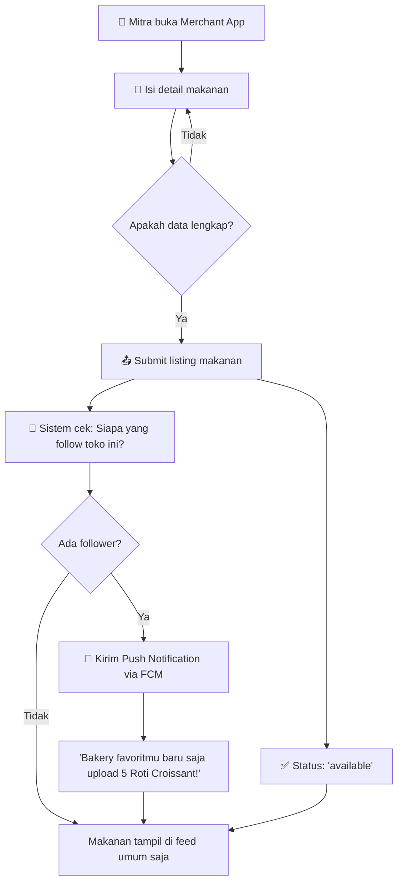
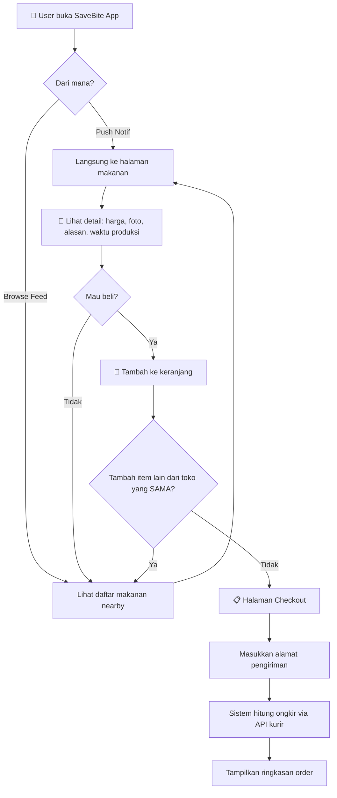
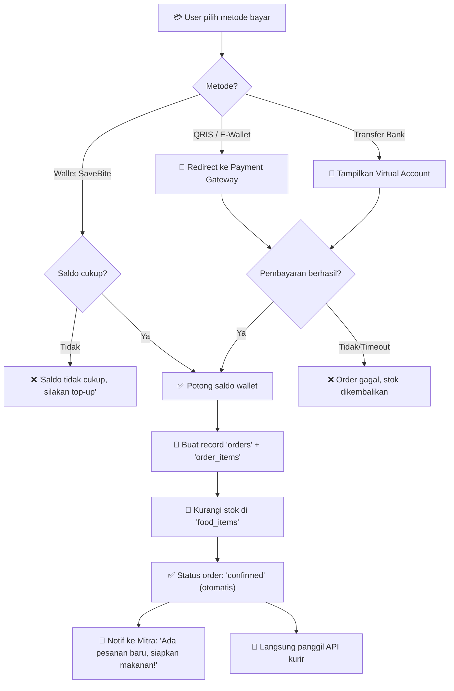
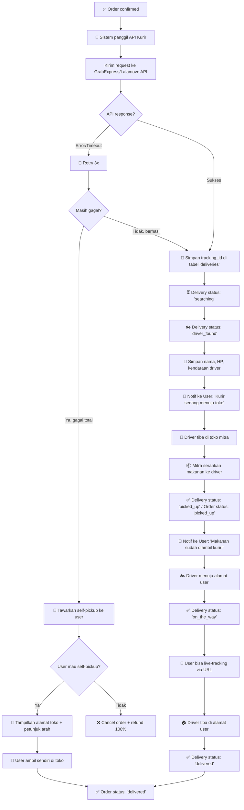
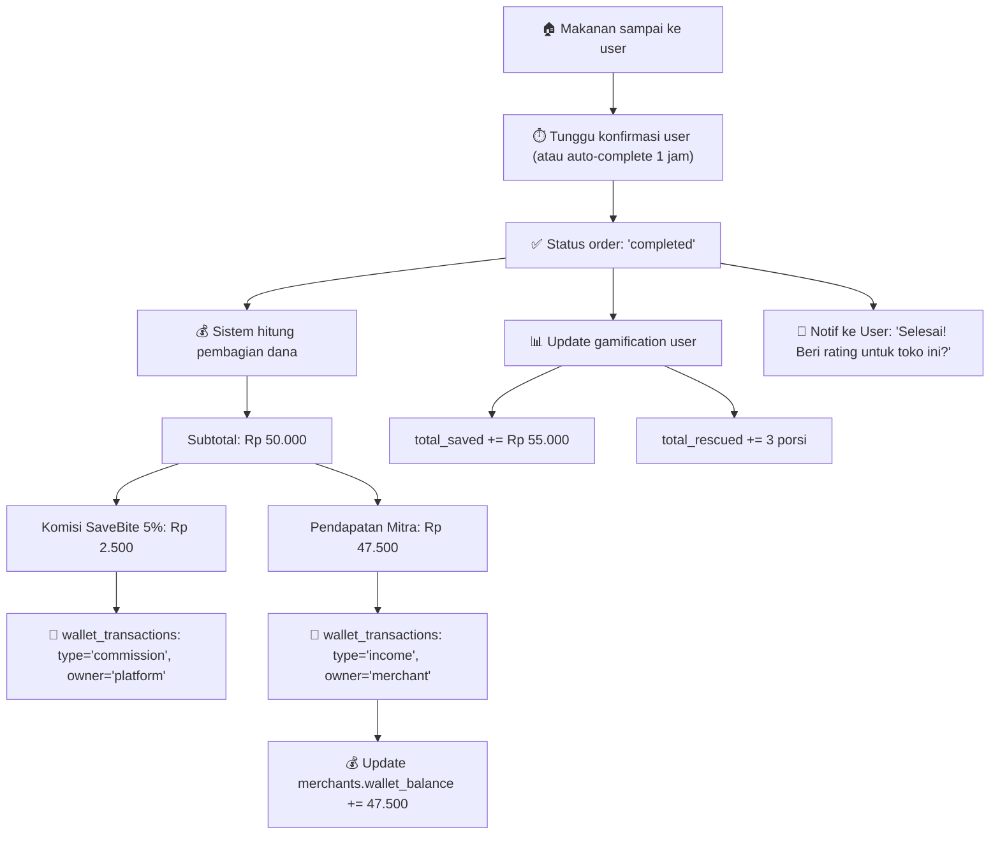
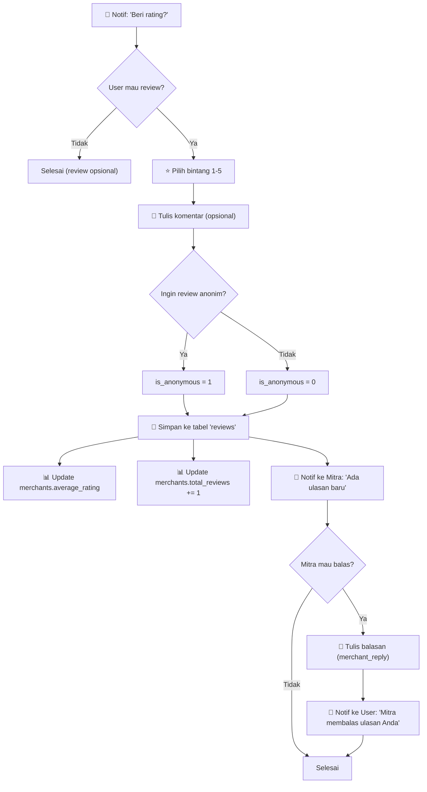
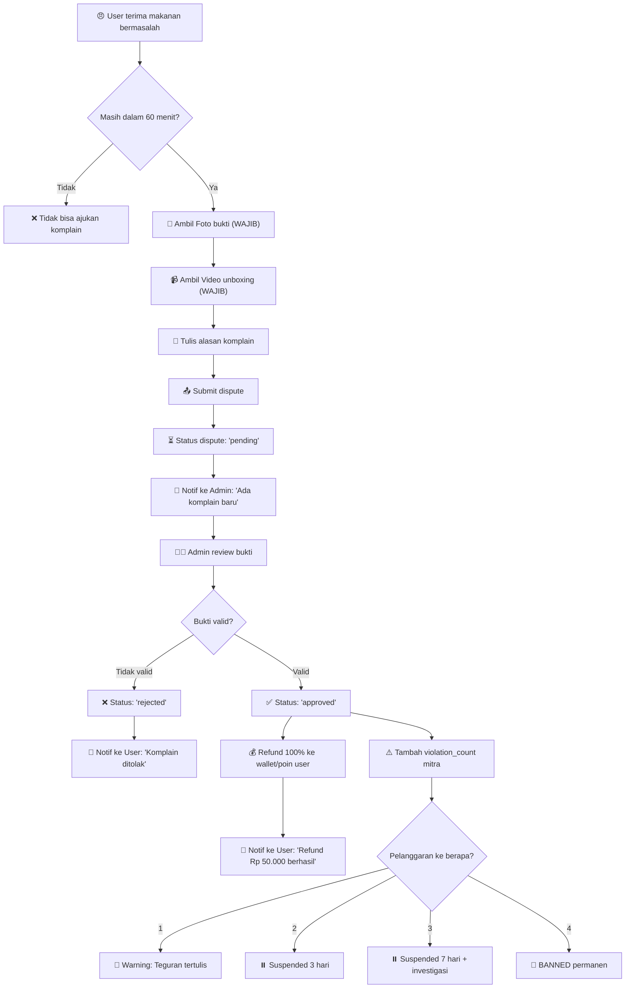
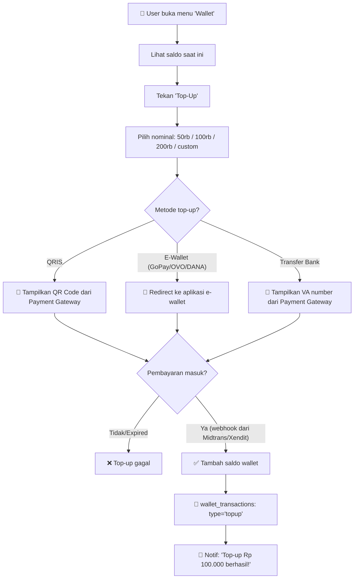

# Alur Kerja (Workflow) - SaveBite
**Versi:** 1.2  
**Date:** 6 Mei 2026  
**Changelog v1.1:** Fix hitung harga, auto-confirm order, alur self-pickup, alur top-up wallet, aturan 1 order = 1 mitra.  
**Changelog v1.2:** Fix delivery status detail, video wajib untuk dispute, bank_transfer di checkout, self-pickup lifecycle.

---

## Gambaran Umum Alur

```
┌──────────┐     ┌──────────┐     ┌──────────┐     ┌──────────┐     ┌──────────┐
│  MITRA   │ ──▶ │ SAVEBITE │ ──▶ │   USER   │ ──▶ │  KURIR   │ ──▶ │  SELESAI │
│  Upload  │     │ Platform │     │  Pesan   │     │  Antar   │     │  Review  │
└──────────┘     └──────────┘     └──────────┘     └──────────┘     └──────────┘
```

> ⚠️ **Aturan Penting:** 1 order = 1 mitra. Jika user ingin beli dari 2 toko berbeda,
> harus buat 2 order terpisah (seperti GoFood/GrabFood).

---

## Alur 1: Mitra Mengunggah Makanan

> Mitra memiliki stok berlebih atau toko akan segera tutup.



### Detail Data yang Wajib Diisi Mitra:
| Field | Contoh | Wajib? |
|-------|--------|--------|
| Nama Makanan | Roti Croissant Coklat | ✅ |
| Foto | upload gambar | ❌ (tapi disarankan) |
| Harga Normal | Rp 35.000 | ✅ |
| Harga Rescue | Rp 15.000 | ✅ |
| Stok Tersedia | 5 porsi | ✅ |
| Alasan Diskon | "Toko tutup 30 menit lagi" | ✅ |
| Waktu Produksi | 06:00 pagi ini | ✅ (untuk siap saji) |
| Tanggal Kedaluwarsa | 07 Mei 2026 | ✅ (untuk kemasan) |

---

## Alur 2: User Memesan Makanan

> User mendapat notifikasi atau browsing feed, lalu memilih makanan.



### Tampilan Ringkasan Order:
```
┌──────────────────────────────────────────────────────┐
│               RINGKASAN PESANAN                      │
├──────────────────────────────────────────────────────┤
│ 🥐 Roti Croissant Coklat  x2                        │
│    Normal: Rp 70.000 → Rescue: Rp 30.000            │
│ 🍰 Slice Cheesecake       x1                        │
│    Normal: Rp 35.000 → Rescue: Rp 20.000            │
├──────────────────────────────────────────────────────┤
│ Subtotal                              Rp 50.000      │
│ Ongkir (GrabExpress)                  Rp 12.000      │
├──────────────────────────────────────────────────────┤
│ TOTAL BAYAR                           Rp 62.000      │
│ Anda hemat              Rp 55.000 (dari Rp 105.000) │
├──────────────────────────────────────────────────────┤
│            [ Bayar Sekarang 💳 ]                     │
└──────────────────────────────────────────────────────┘
```

---

## Alur 3: Pembayaran & Auto-Confirm Order

> Order otomatis dikonfirmasi setelah pembayaran berhasil.
> Mitra **tidak perlu** menekan tombol "Terima" — cukup siapkan makanan.



### Alur Mutasi Wallet Saat Pembayaran:
```
┌─────────────────────────────────────────────────────┐
│  wallet_transactions (untuk user)                   │
├─────────────────────────────────────────────────────┤
│  type: 'payment'                                    │
│  amount: -62.000                                    │
│  balance_before: 100.000                            │
│  balance_after: 38.000                              │
│  description: 'Pembayaran order SB-20260506-0001'   │
└─────────────────────────────────────────────────────┘
```

---

## Alur 4: Pengiriman via Kurir (Inti Proses)

> Ini adalah alur kritis: bagaimana makanan berpindah dari dapur mitra ke tangan user.



### Detail Integrasi API Kurir:
```
┌──────────────────────────────────────────────────────┐
│  REQUEST ke GrabExpress API                          │
├──────────────────────────────────────────────────────┤
│  POST /v1/deliveries                                 │
│  {                                                   │
│    "origin": {                                       │
│      "address": "Jl. Sudirman No.10 (alamat mitra)", │
│      "lat": -6.2088,                                 │
│      "lng": 106.8456                                 │
│    },                                                │
│    "destination": {                                  │
│      "address": "Jl. Gatot Subroto (alamat user)",   │
│      "lat": -6.2350,                                 │
│      "lng": 106.8200                                 │
│    },                                                │
│    "package": {                                      │
│      "description": "Makanan - Handle with care",    │
│      "weight": 1                                     │
│    }                                                 │
│  }                                                   │
├──────────────────────────────────────────────────────┤
│  ⚠️ Catatan untuk Anonymous Merchant:                │
│  Identitas toko TIDAK dikirim ke user.               │
│  User hanya lihat: "Pesanan dari Bakery Anonim"      │
│  Tapi driver tetap dapat alamat lengkap toko.        │
│                                                      │
│  ⚠️ Catatan untuk Self-Pickup:                       │
│  Jika user pilih self-pickup, alamat toko            │
│  ditampilkan KECUALI toko berstatus anonymous.       │
│  Toko anonymous tidak mendukung self-pickup.         │
└──────────────────────────────────────────────────────┘
```

---

## Alur 5: Order Selesai & Pembagian Dana

> Setelah makanan diterima user, dana dibagi antara mitra dan SaveBite.



### Ilustrasi Pembagian Dana:
```
 User bayar: Rp 62.000
        │
        ├── Ongkir Rp 12.000 ──────▶ Langsung ke kurir (via API)
        │
        └── Subtotal Rp 50.000
                │
                ├── 5% = Rp 2.500 ──▶ 💼 Kas SaveBite (platform)
                │
                └── 95% = Rp 47.500 ─▶ 🏪 Wallet Mitra
```

---

## Alur 6: Review & Rating (Post-Order)



---

## Alur 7: Komplain & Dispute (Jika Bermasalah)



---

## Alur 8: Top-Up Wallet SaveBite (BARU)



---

## Ringkasan Status Order (Lifecycle)

```
                                                    ┌───────────┐
                                                    │ cancelled │
                                                    │  (batal)  │
                                                    └───────────┘
                                                          ▲
                                                          │
┌─────────┐    ┌───────────┐    ┌───────────┐    ┌───────────┐    ┌───────────┐
│ pending  │──▶│ confirmed │──▶│ picked_up │──▶│ delivered │──▶│ completed │
│(bayar)   │    │(auto+kurir)│   │(kurir amb.)│   │ (sampai)  │    │ (selesai) │
└─────────┘    └───────────┘    └───────────┘    └───────────┘    └───────────┘
                     │
                     └──▶ [self-pickup] ──▶ delivered ──▶ completed
```

### Kapan Status Berubah:
| Dari | Ke | Pemicu |
|------|----|--------|
| `pending` | `confirmed` | Pembayaran berhasil (otomatis, tanpa konfirmasi mitra) |
| `confirmed` | `picked_up` | Driver kurir mengambil makanan dari toko |
| `confirmed` | `delivered` | User self-pickup langsung di toko (jika kurir gagal) |
| `picked_up` | `delivered` | Driver sampai di alamat user |
| `delivered` | `completed` | User konfirmasi terima **ATAU** auto-complete setelah 1 jam |
| `confirmed` | `cancelled` | Driver tidak ditemukan + user tolak self-pickup, atau stok habis |

---

## Diagram Waktu (Timeline Tipikal)

```
Waktu ──────────────────────────────────────────────────────────▶

20:30   Mitra upload "5x Roti Croissant" (toko tutup jam 21:00)
  │
20:30   Push Notif ke 23 follower: "Ada Croissant baru!"
  │
20:32   User A pesan 2x Croissant + 1x Cheesecake
  │
20:32   Pembayaran via QRIS ✅ → Order auto-confirmed
  │
20:32   API kurir dipanggil + Notif ke Mitra: "Siapkan makanan!"
  │
20:35   Driver ditemukan, menuju toko
  │
20:42   Driver tiba di toko, ambil makanan
  │
20:55   Makanan sampai di User A ✅
  │
20:56   User A beri rating ⭐⭐⭐⭐⭐
  │
20:56   Dana dibagi: Rp 47.500 → Mitra, Rp 2.500 → SaveBite
```
